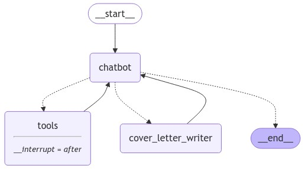

# Job Applier - LangGraph Application

This Streamlit application assists users in finding jobs and generating personalized cover letters. It uses LangGraph to control the job search flow, integrating Google Jobs and a language model to generate relevant job suggestions based on user input. If the user approves a job, a cover letter is automatically created for them.

## Features
- **Job Search**: Uses LangGraph and Google Jobs to retrieve jobs matching user preferences.
- **Feedback Mechanism**: Allows the user to review each job posting and request another if it's not suitable.
- **Cover Letter Generation**: Automatically creates a tailored cover letter based on the user’s background and the job description if the job is approved.

## Running the Application
Clone this repository:
`git clone https://github.com/Sherry141/LangGraph-Job-Applier`

Launch the Streamlit app:
`streamlit run job_applier_advanced_streamlit.py`

## Logic Flow and Graph Nodes
This application uses LangGraph to define and manage the flow of the job search and cover letter generation. Below is an overview of each graph node and the logic flow. 

### 1. Chatbot Node
 - Purpose: Serves as the primary interface for handling user requests and responses.
 - Functionality: Initiates the search by taking the user's input (job request and background) and calling Google Jobs if a new job search is required.
- Interaction: The chatbot collects the job search details and either continues to retrieve a job or passes the information on for feedback processing.
### 2. Tool Node
 - Purpose: Makes tool calls to external APIs, such as Google Jobs, to retrieve job postings.
 - Functionality: This node is activated when the chatbot decides another job search is necessary, allowing the user to fetch multiple job options if needed.
### 3. Cover Letter Writer Node
 - Purpose: Generates a cover letter once the user approves a job.
 - Functionality: Takes the job description and the user’s background to create a concise, professional cover letter with a personalized touch.
### 4. Decision Maker
- Purpose: Controls the transition between nodes based on the user’s responses.
- Logic:
    - If the user approves the job, it directs the flow to the Cover Letter Writer Node.
    - If the user rejects the job, it loops back to initiate another search using the Tool Node.
    - Ends the flow once the cover letter is generated.
## Example Usage
 - Input: The user provides a job preference, such as "Give me a job in frontend software development. I have 3 years of experience."
 - Job Retrieval: The chatbot retrieves and displays a job posting using Google Jobs.
 - User Feedback: The user can approve or reject the job.
    - If Approved: The cover letter generator creates a customized cover letter.
    - If Rejected: The Tool Node retrieves another job posting, repeating the feedback loop.
 - Cover Letter: Once approved, the generated cover letter is displayed for the user.